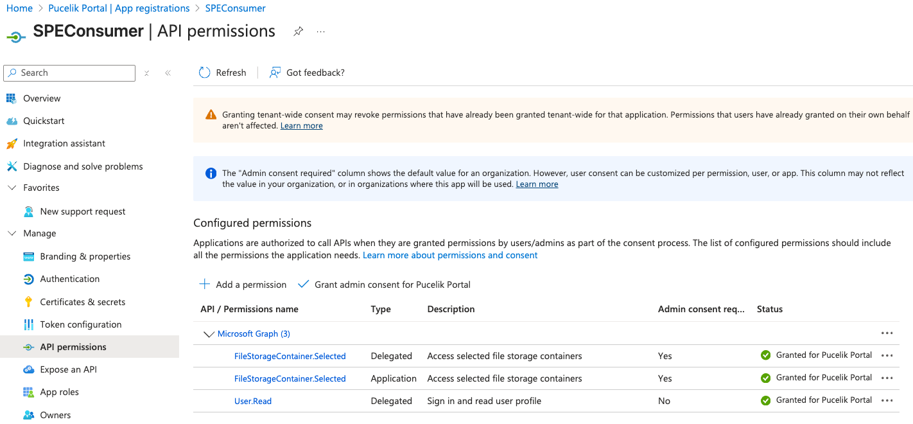

# SharePoint Embedded ISV Setup Guide

This outlines a comprehensive step-by-step guidance for Independent Software Vendors (ISVs) to configure their SharePoint Embedded applications in customer tenants.

## Overview

SharePoint Embedded enables ISVs to build applications that include dedicated file and document management capabilities. When you are ready to deploy it to your customers environment, there are some security and configuration steps that need to be done.  This guide walks through the complete process of setting up your application in your customers tenant, including:

- Creating an Azure App Registration
- Configuring necessary permissions and API access
- Obtaining admin consent from consuming tenant administrator
- Registering the your application using certificate-based SharePoint authentication on your customers tenant
- Creating SharePoint Embedded containers


## Getting Started

### Glossary

- **Container Type** - sets the rules for how a container—like a document library—is created and managed by the owning tenant. It also controls how other (consuming) tenants can access and use the content inside the container, making sure permissions and sharing follow the right governance.
- **Owning tenant** - this is the tenant that you have created your application in to include a Container Type and Containers that hold documents.
- **Consuming tenant** - this is your customers tenant.  
  


> **ℹ️ Important**
> 
> This assumes that you have a Standard container type in the owning tenant and not a Direct To Bill Container Type.

### Prerequisites

Before you begin, ensure you have:

1. **For ISV (Owning Tenant)**:
   - Azure subscription and access to create App Registrations
   - Global Administrator or Application Administrator role
   - PowerShell 7.x or later
   - Required PowerShell modules

2. **For Customer (Consuming Tenant)**:
   - Azure App Registration with appropriate permissions
   - Ability to grant admin consent to applications


## Step-by-Step Guide

### Step 1: Create Azure App Registration in the consuming tenant

The following steps will be completed in the consuming tenant.

1. Create a new App Registration in Entra ID.  You can name it whatever you want.
2. A few items you'll need later:

    
 
 

    - **Application ID** - this will be needed so you can properly authenticate to the consuming tenant.
    - **Tenant ID** - the consuming tenant id required to authenticate and get the correct tokens.


3. Add the Graph endpoints.  This is required to properly interact with the SharePoint Embedded API.

    


4.  Create or upload an available certificate.  This is required to generate a certificate based token from SharePoint during the registration process.
   
    

    Note the thumbprint as we will need that in the upcomming steps.

5.  Crate a client secret.  

    > **ℹ️ Important**
    > 
    > **NOTE**:  Once you navigate away from the page, you will not be able to retrieve the Value.

6. Add the required Graph permissions.
  
     - FileStorageContainer.Selected - Delgated
     - FileStorageContainer.Selected - Application

        

### Step 2: Obtain Admin Consent 

Tenant admin consent is required so the consuming tenant explicitly establishes trust with the owning application and grants the tenant‑scoped permissions SharePoint Embedded needs to register and manage containers. This consent creates the app’s service principal in the consuming tenant and authorizes the exact permissions requested (e.g., app‑only or delegated configured in the App Registration), ensuring the organization’s security and compliance policies are respected. Without admin consent, the app remains untrusted and registration and container operations are blocked (e.g., “access denied”).

#### Construct the Admin Consent URL

The admin consent URL follows this format:

```
https://login.microsoftonline.com/<ConsumingTenantID>/adminconsent?client_id=<OwningTenantClientID>
```

#### Fill in the Parameters

Replace the placeholders with your application's values:

- `{ConsumingTenantID}`: This would be your customers tenant ID.
- `{OwningTenantClientId`: Your Application (client) ID from the Azure App Registration


### Step 3: Register Owning App in Consuming Tenant

Use the following PowerShell script to register your owning application on the consuming tenant.  This will create the proper certificate based SharePoint token required to register your app with your customers tenant.

```powershell
# Variables you fill in
$ConsumingTenantId = "<ConsumingTenantId"
$RootSiteHost      = "<ConsumingTenantName>.sharepoint.com"         # consuming tenant root host.  contoso.sharepoint.com
$OwningAppClientId = "<OwningAppClientId>"                          # owning app client id
$CertThumbprint    = "<CertThumbprint>"                             # cert bound to the owning app
$CertStore         = "<CertLocation>"                               # or Cert:\LocalMachine\My, typically in the certificate store.
$ContainerTypeId   = "<ContainerTypeId>"                            # container type to register from the owning app

# 1) Load the cert
$cert = Get-ChildItem -Path $CertStore | Where-Object Thumbprint -eq $CertThumbprint

# 2) Get a SharePoint token where aud = https://{RootSiteHost}
Import-Module MSAL.PS
$spToken = Get-MsalToken -ClientId $OwningAppClientId `
  -TenantId $ConsumingTenantId -ClientCertificate $cert `
  -Scopes "https://$RootSiteHost/.default"

# 3) Register the container-type permissions (PUT, not POST)
$headers = @{
  Authorization = "Bearer $($spToken.AccessToken)"
  Accept        = "application/json;odata.metadata=none"
  "Content-Type"= "application/json"
}
$containerTypeId = $ContainerTypeId

$body = @{
  value = @(
    @{
      appId     = $OwningAppClientId           # owning app
      delegated = @("full")
      appOnly   = @("full")                    # or at least "create"
    }
  )
} | ConvertTo-Json -Depth 5

Write-Host $body

$uri = "https://$RootSiteHost/_api/v2.1/storageContainerTypes/$containerTypeId/applicationPermissions"
Invoke-RestMethod -Method PUT -Uri $uri -Headers $headers -Body $body
```

Once this has successfully executed, you can run this PowerShell command in the consuming tenant to verify it was registered.  The OwningApplicationId will match your Azure App registration in your tenant (owning tenant).

Note this is a SharePoint PowerShell command so you will need to login as the SharePoint Admin.

```powershell
Get-SPOApplication | Format-List

Sample Output:

RunspaceId            : d5dcc55e-2578-4307-b8d8-7c3fa8bfb58f
OwningApplicationId   : f9aebe44-3b50-48b5-832b-56292b9bd493
OwningApplicationName : SPEProjects
```


### Step 4: Create SharePoint Embedded Container

Once the owning app is registered, create containers:

   1. You will need to obtain the proper Graph token, necessary for creating a container.  In this example I'm using Bruno to request the token.


#### Fill in the Parameters

Replace the placeholders with your application's values:

- `{ConsumingTenantID}`: This would be your customers tenant ID.
- `{ClientID`: Your Application (client) ID from the Azure App Registration
- `{ClientSecret`: The client secret from your Azure App Registration


2. Create a container using the following Graph command:

    ```json
    PUT https://graph.microsoft.com/v1.0/storage/fileStorage/containers

    {
    "displayName": "Consumer-Container",
    "description": "Consumer-Container",
    "containerTypeId": "{{ContainerTypeId}}"
    }
    ```

#### Fill in the Parameters

Replace the placeholders with your application's values:

- `{displayName}`: The name that will appear in your API results.
- `{description`: Brief description on the purpose of the container
- `{containerTypeId}`: The ContainerTypeId from your application.  Note, a ContainerTypeId will NOT be created in the consuming tenant.

## SharePoint Admin Center
As containers are created, your customers SharePoint Admins, or SharPoint Embedded Admins (Entra ID Roles) will be able to see your application and the containers that have been created.


## Support and Resources

- [SharePoint Embedded Documentation](https://learn.microsoft.com/en-us/sharepoint/dev/embedded/overview)
- [Azure App Registration Documentation](https://learn.microsoft.com/en-us/azure/active-directory/develop/quickstart-register-app)
- [Install your SharePoint Embedded application for customers](https://learn.microsoft.com/en-us/sharepoint/dev/embedded/development/tutorials/vendor-install-app-customer)
- [Microsoft Graph API Reference](https://aka.ms/spe-api)


